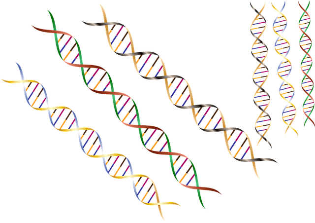

# Proyecto2Programacion20191
Proyecto del segundo corte de la unidad  de programación

# Las Secuencias de ADN

Una cadena de ADN esta formada por bases de Adenina, Guanina, Citocina y
Tiamina 'A, T, C, G', adicionalmente las cadenas de ADN se organizan en
pares enlazados los cuales deben ser complementados de la siguiente
forma A <-> T y C <-> G.

El objetivo de esta aplicación es evaluar si dos cadenas de ADN son
Correspondientes y adicionalmente obtener la cadena complementaria.

Finalmente se desea evaluar el nivel de correspondecia entre una cadena y una
no valida.

# 
## Se recomienda dividir el problema en partes mas simples:

1. La función obtener complento que retorna el complemento de una base

1. La función para generar la cadena complementaria

1. La función para validar una base

1. La función para calcular el porcentaje de correspondencia de una cadena y otra

1. La función que nos valida la correspondencia entre dos cadenas

1. La función para validar si todos las bases son validas en la cadena

1. La función es base

### ¿Que hacer Despues?

* Mejora utilice las funciones creadas para leer cadenas de ADN
de un archivo y validar sus complementos

* Evalue el nivel de correspondencia de las cadenas en 
su archivo para detectar anomalias geneticas

---

## Metodología

- En este directorio encontrarán dos archivos de Python:
    1. "funciones.py" contiene las funciones en blanco a implementar.
    2. "pruebas.py" contiene las pruebas que le ayudarán a validar el correcto
funcionamiento de su implementación.

- Realice un fork al repositorio en Github.

- Cree una rama en su repositorio para:
    -Desarrollo
    -Documentación
    -Pruebas

- En grupo dividan el número de funciones de tal forma que cada uno aporte en las fuciones los siguientes roles diferentes:
    - Documentador
    - Pruebas
    - Desarollador

- Documente cada una de las funciones incluyendo las pruebas

- Desarrolle todas las funciones teniendo en cuenta la receta para la elaboración de una función (Recuerde reutilizar las funciones).

- Valide el funcionamiento con las pruebas.

- Valide sus funciones contra las pruebas realizadas

- Suba las capturas de las evidencias de commit de todos los integrantes del grupo en un iforme de desarrollo del proyecto al aula virtual, asi como, el código fuente de su solución.
